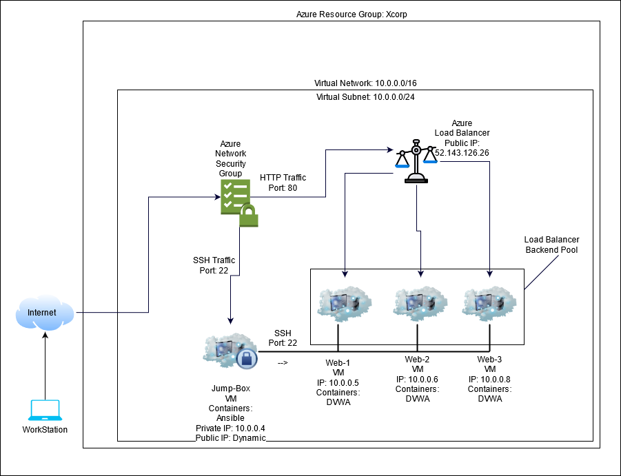

## Automated ELK Stack Deployment

The files in this repository were used to configure the network depicted below.

These files have been tested and used to generate a live ELK deployment on Azure. They can be used to either recreate the entire deployment pictured above. Alternatively, select playbooks found in "./ansible/playbook/" may be used to install only certain pieces of it, such as Filebeat.

  - Ansible Playbooks located in: ./ansible/playbook/

This document contains the following details:
- Description of the Topology
- Access Policies
- ELK Configuration
  - Beats in Use
  - Machines Being Monitored
- How to Use the Ansible Build

### Description of the Topology

The main purpose of this network is to expose a load-balanced and monitored instance of DVWA, the Damn Vulnerable Web Application.

Load balancing ensures that the application will be highly efficient and responsive to users, in addition to restricting unwanted access to the network.
- A Load Balancer can be a great addition to any network hosting services because it can mask the actual IP's and identities of the servers behind the public IP of the load balancer.  They also help mitigate against small DOS attacks.

Integrating an ELK server allows users to easily monitor the vulnerable VMs for changes to the file system and system resources.
- The filebeat "Beat" allows the logging of changes to the local system files.
- The metricbeat "Beat" allowsan administrator to keep track of CPU/RAM usage, Network utilization, among others. 

The configuration details of each machine may be found below.
_Note: Use the [Markdown Table Generator](http://www.tablesgenerator.com/markdown_tables) to add/remove values from the table_.

| Name     | Function   | IP Address | Operating System |
|----------|------------|------------|------------------|
| Jump Box |Gateway     | 10.0.0.4   | Linux            |
| Web-1    |WebServer   | 10.0.0.5   | Linux            |
| Web-2    |WebServer   | 10.0.0.5   | Linux            |
| Web-3    |WebServer   | 10.0.0.5   | Linux            |
| Elk      |Kibana-Host | 10.1.0.4   | Linux            |
| Load-Bal |LoadBalancer| 0.0.0.0    | N/A              |

### Access Policies

The machines on the internal network are not exposed to the public Internet. 

Only the JumpBox machine can accept connections from the Internet. Access to this machine is only allowed from the following IP addresses: NOT LISTING MY IP PUBLICALLY!!!!

Machines within the network can only be accessed by Ansible Container from JunmpBox.
- The ELK machine, or Kibana GUI can only be accessed by my IP and computers on my LAN.  I will not list my Public IP.

A summary of the access policies in place can be found in the table below.

| Name     | Publicly Accessible | Allowed IP Addresses |
|----------|---------------------|----------------------|
| Jump Box | Yes                 | MY PUBLIC IP         |
|          |                     |                      |
|          |                     |                      |

### Elk Configuration

Ansible was used to automate configuration of the ELK machine. No configuration was performed manually, which is advantageous because this ansible-playbook can be used to re-deploy the same working environment in case of any emergencies/disasters.  It also makes new servers on the network simple to setup.

The playbook implements the following tasks:
- Elk can be installed in 6 painless steps, starting by downloading and installing Docker.
- Secondly you would want to install python-pip3 and the "pip" docker module.
- You must also increase the size of the vm.max_map_count variable to '262144'
- Install ELK inside a docker container.
- Ensure that docker and ELK start with system boot-up process.

The following screenshot displays the result of running `docker ps` after successfully configuring the ELK instance.

***PLEASE note that ports 5044, 5601, 9200 Have all been forwarded from the container to the host machine***

### Target Machines & Beats
This ELK server is configured to monitor the following machines:
- _TODO: List the IP addresses of the machines you are monitoring_

We have installed the following Beats on these machines:
  - Web-1: Filebeat, Metricbeat
  - Web-2: Filebeat, Metricbeat
  - Web-3: Filebeat, Metricbeat

These Beats allow us to collect the following information from each machine:
- _TODO: Filebeat monitors the system for local file system changes, While metricbeat logs CPU/RAM/Docker utilization. We can use metricbeat logs to ensure our server is never to burdened or over-worked.  This will make sure the end user has the best experience.

### Using the Playbook
In order to use the playbook, you will need to have an Ansible control node already configured. Assuming you have such a control node provisioned: 

SSH into the control node and follow the steps below:
- Copy theansible-config.yml file to /etc/ansible/ansible.yml
- Update the /etc/ansible/hosts file to the group we want to install packages on.
- Run the playbook, and navigate to ____ to check that the installation worked as expected.

- The playbooks are located in "./ansible/playbook" and it is recommended to copy them to your local machine at "/etc/ansible/playbook"
- You must update your /etc/ansible/hosts to include a new group [elk].  Inside this group you will add the IP of servers you wish to install ELK service on.  Using these groups you can choose which hosts to execute playbooks on, and therefore customize your network setup.
- In order to verify your instance of ELK is functional, visit  "http://[ELK-PUBLIC-IP]:5601/app/kibana" and replace "[ELK-PUBLIC-IP]" with the IP of your host.

_As a **Bonus**, provide the specific commands the user will need to run to download the playbook, update the files, etc._
 To download the ELK playbook specifically; you can run the command "curl -H 'Accept: application/vnd.github.v3.raw' https://raw.githubusercontent.com/Ganome/BCS/main/ansible/playbook/install-elk.yml > /etc/ansible/playbook/install-elk.yml" 
