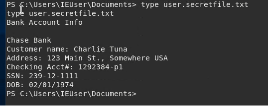
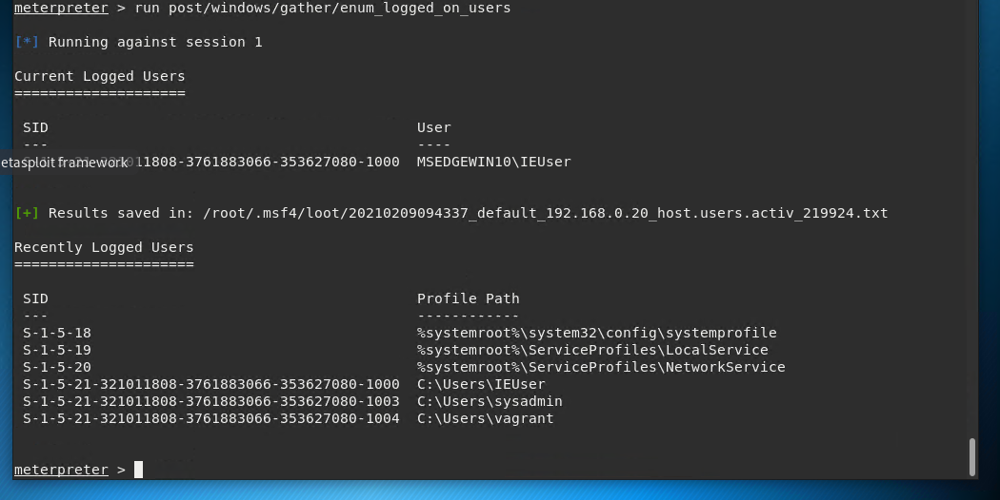
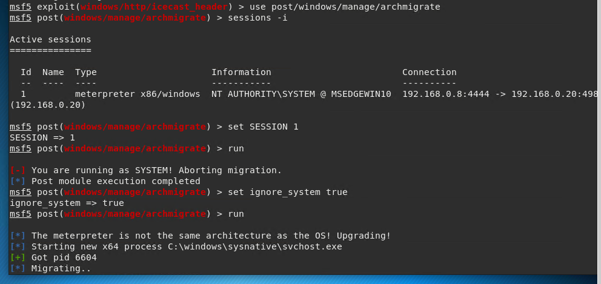
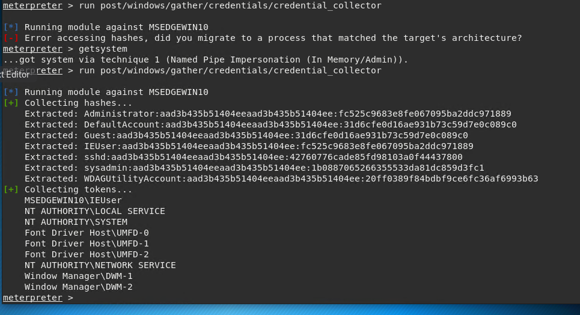

GoodSecurity Penetration Test Report 

Ganome@GoodSecurity.com

2 Feb, 2020

High-Level Summary

GoodSecurity was tasked with performing an internal penetration test on GoodCorp’s CEO, Hans Gruber. An internal penetration test is a dedicated attack against internally connected systems. The focus of this test is to perform attacks, similar to those of a hacker and attempt to infiltrate Hans’ computer and determine if it is at risk. GoodSecurity’s overall objective was to exploit any vulnerable software and find the secret recipe file on Hans’ computer, while reporting the findings back to GoodCorp.
When performing the internal penetration test, there were several alarming vulnerabilities that were
identified on Hans’ desktop. When performing the attacks, GoodSecurity was able to gain access to his machine and find the secret recipe file by exploit two programs that had major vulnerabilities. The details of the attack can be found in the ‘Findings’ category.

Findings

Machine IP: 192.168.0.20 - Machine’s IP address

Hostname: - MSEDGEWIN10

Vulnerability Exploited: IceCast - https://www.cvedetails.com/cve/CVE-2004-1561/ - module "exploit/windows/http/icecast_header"

Vulnerability Explanation:
Explain the vulnerability as best you can by explaining the attack type (i.e. is it a heap overflow attack, buffer overflow, file inclusion, etc.?) and briefly summarize what that attack is (Might need Google’s help!)

Severity: 7.5 Critical/High This is an extremely bad vulnerability, due to the fact it allows any attackers full access to the machine.

Proof of Concept:
 - Start by doing a service scan of the Host machine

 - Gather information on IceCast exploits

 - Recipe file

 - User's secret file

BONUS:

Enumerate all logged in users:

Gather System Information:

SUPER BONUS:

In order to achieve the super bonus, you must first gain System credentials with the command "getsystem" in the meterpreter shell.  Then laterally transfer from a 32-bit meterpreter shell into a 64-bit meterpreter shell, because the host OS is 64-bit.

I again ran the "getsystem" command once again, but from the new x64 instance.  Once you have System credentials, you can run the post meterpreter module "hashdump" for clean output or the module "credential_collector"; if you want to clean up the output yourself.

Once you have the hashes from the accounts on the system, its time to put them into a txt file on your local machine and run hashcat against them.  I used the rockyou.txt password list, and a "-m 1000" argument with hashcat to identify NTLM Hash mode.

Voila! - In this instance, the "Administrator" password is the same as the "IEUser" account #there hashes are identical

Recommendations

I would recommend to stop using the IceCast service completely.  Also change your Administrator password!