Unit 18 - SIEM Part 1 Homework

STEP 1: THE NEED FOR SPEED

1:

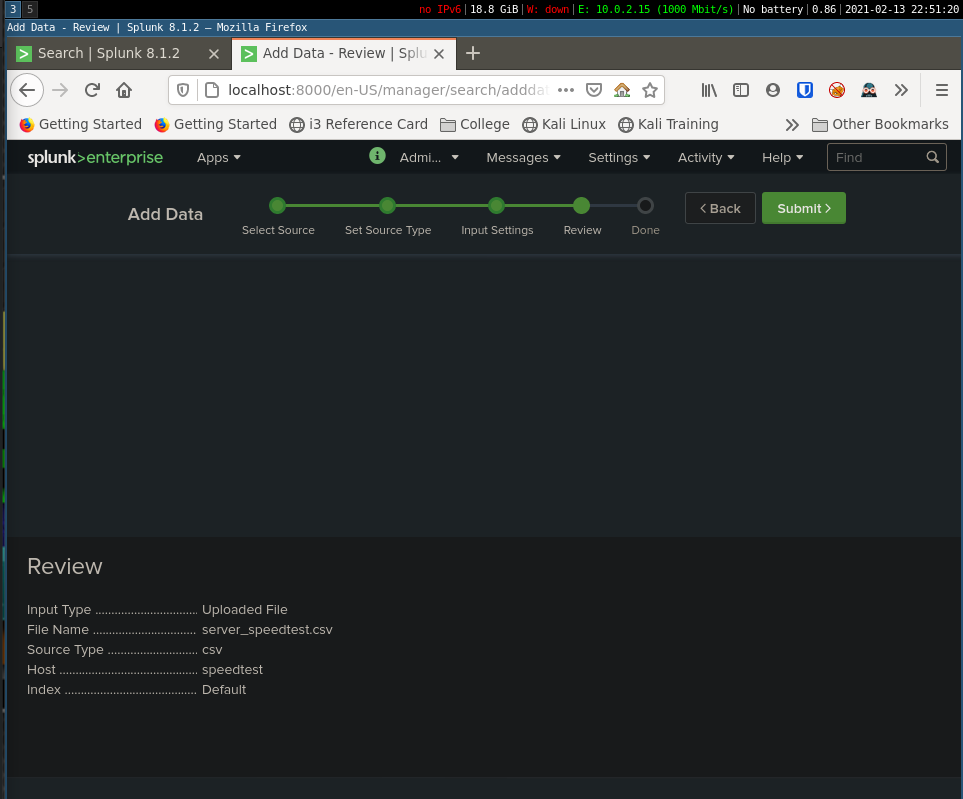

2:

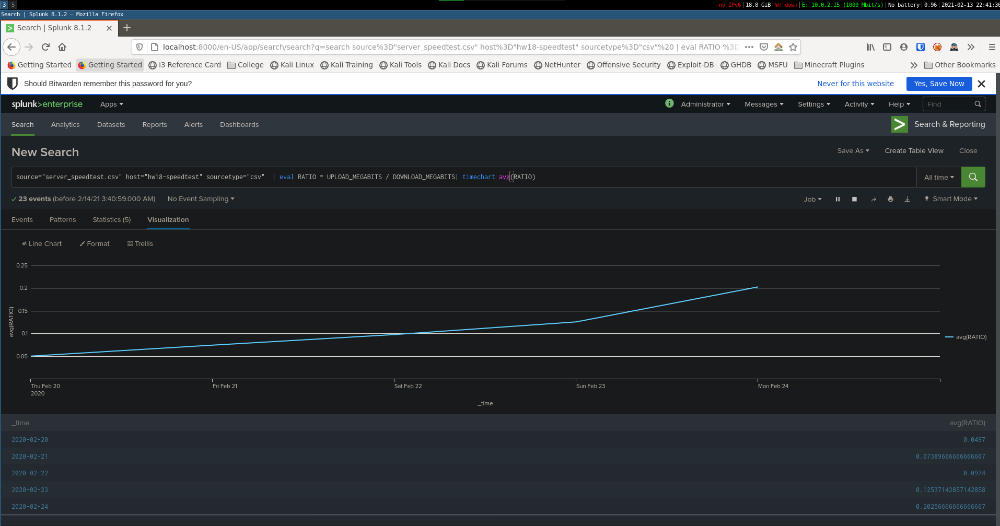

3:

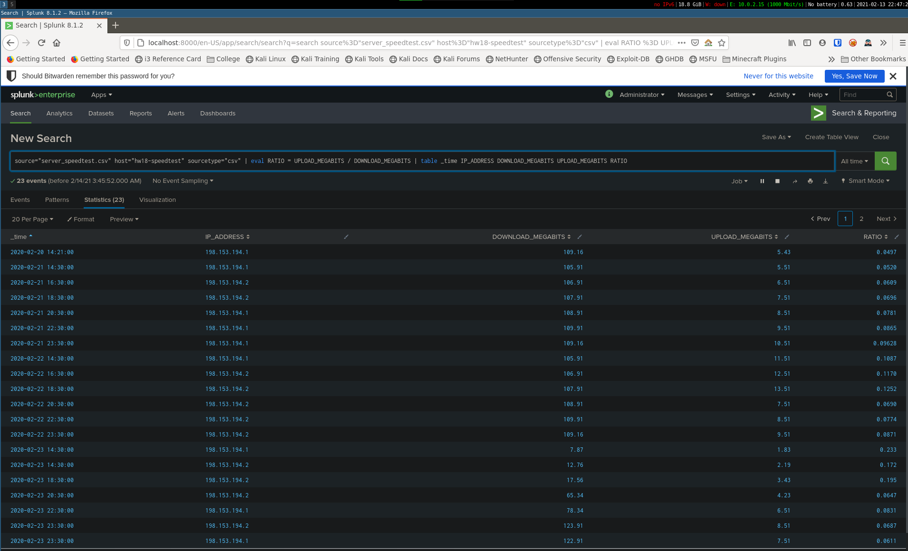

4:

 - I believe the approximate time of the attack was 23 Feb 2020 @ 14:30:00.  The network was still stugging around a mere 60-80 MEGABITS downstream until around 23 Feb 2020 @ 23:30:00.  This was a total of 5 hours of severe DDOS, and then another 4 hours of recovery.  This adds up to a total of 9 hours affected traffic.

 
 STEP 2: ARE WE VULNERABLE?

 1:

 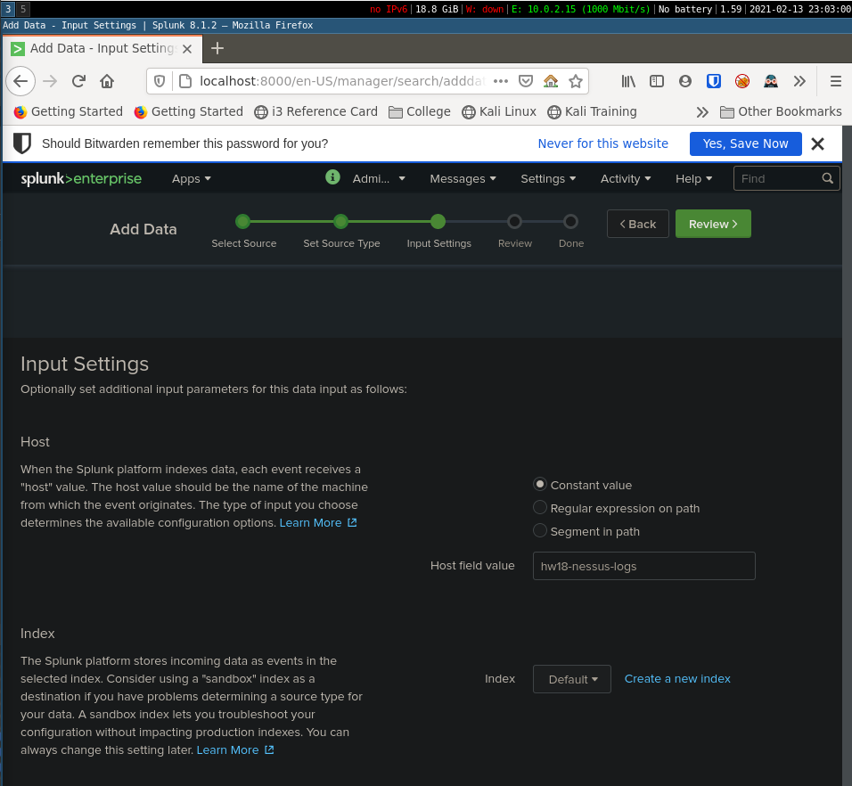

 2:

 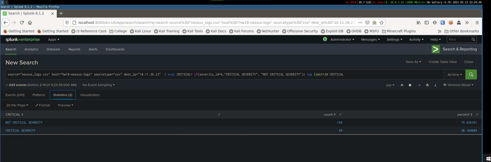

 3:

 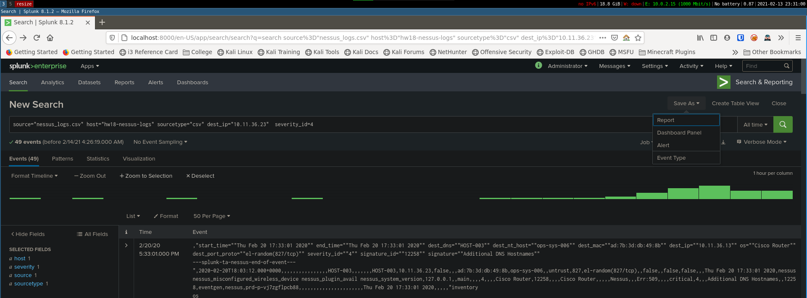

 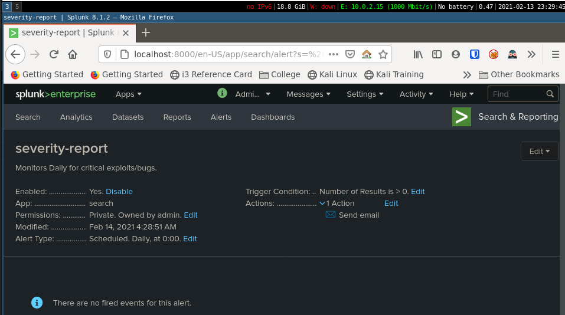

 STEP 3: DRAWING THE (base)LINE

 1:

 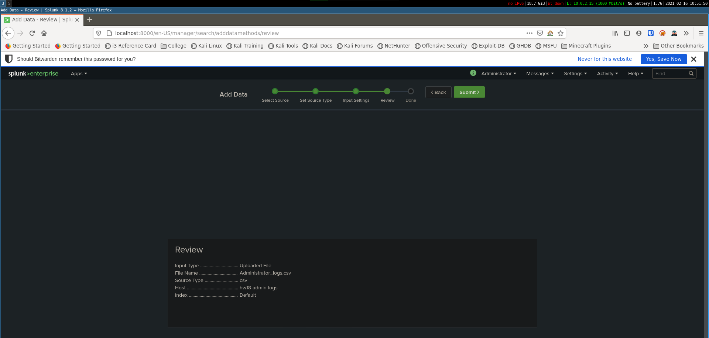

 2: The brute force attack likely started on the 21 Feb, 2020 @ 09:00:00

 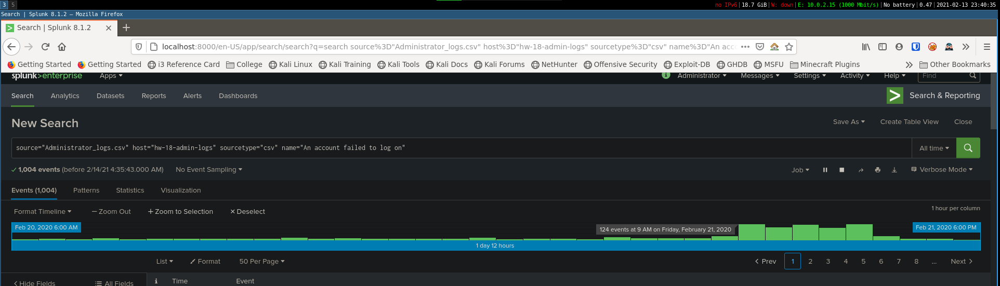

 3:  I feel the average failed login attempts are somewhere in the mid 20's.  So a thresh-hold somewhere in the range of 25-30 would be acceptable.

4:

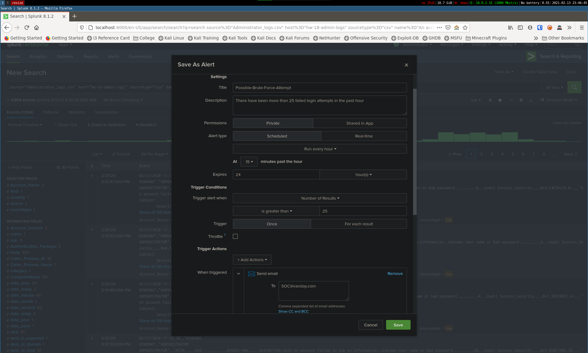

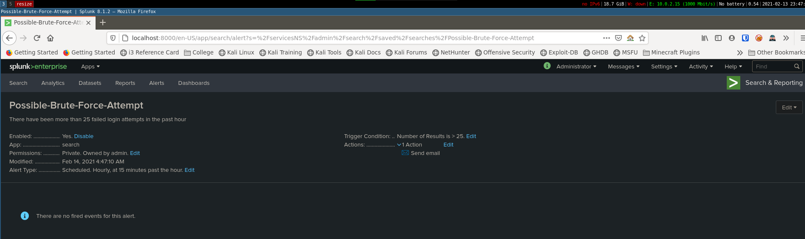