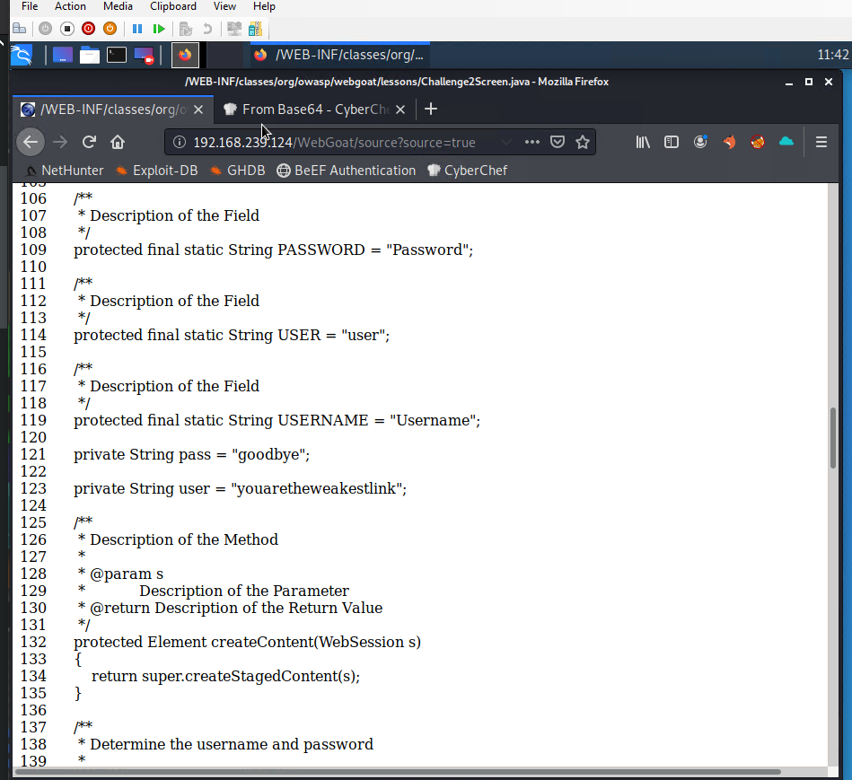
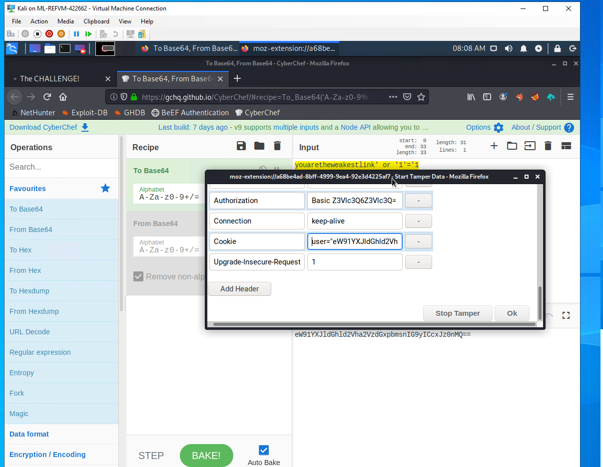
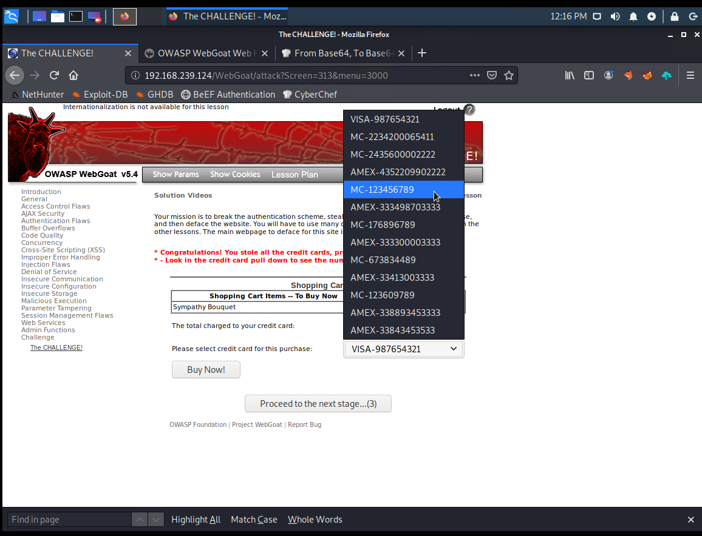
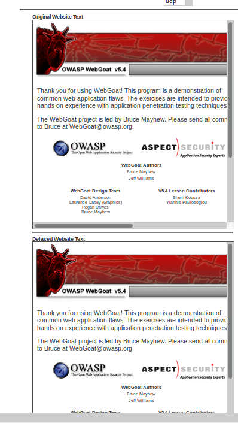
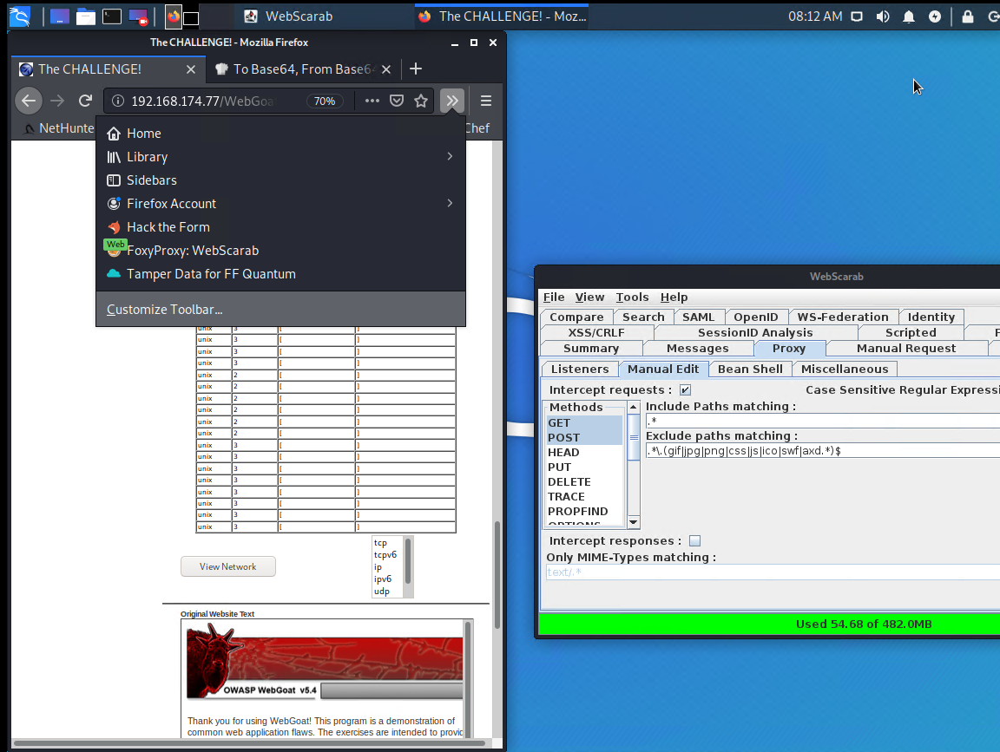
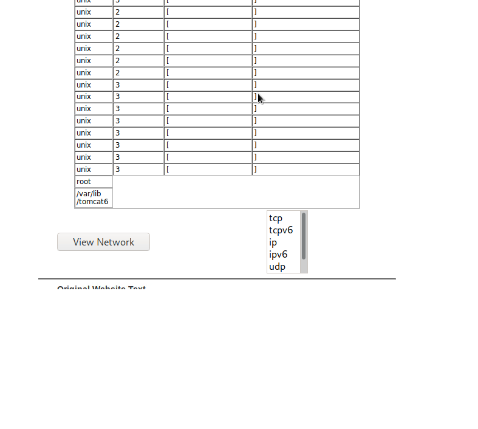
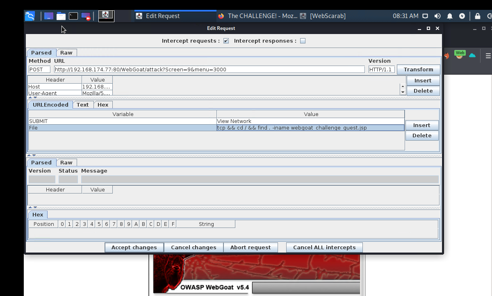
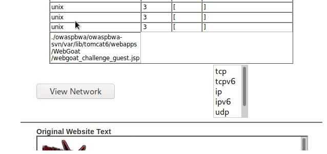
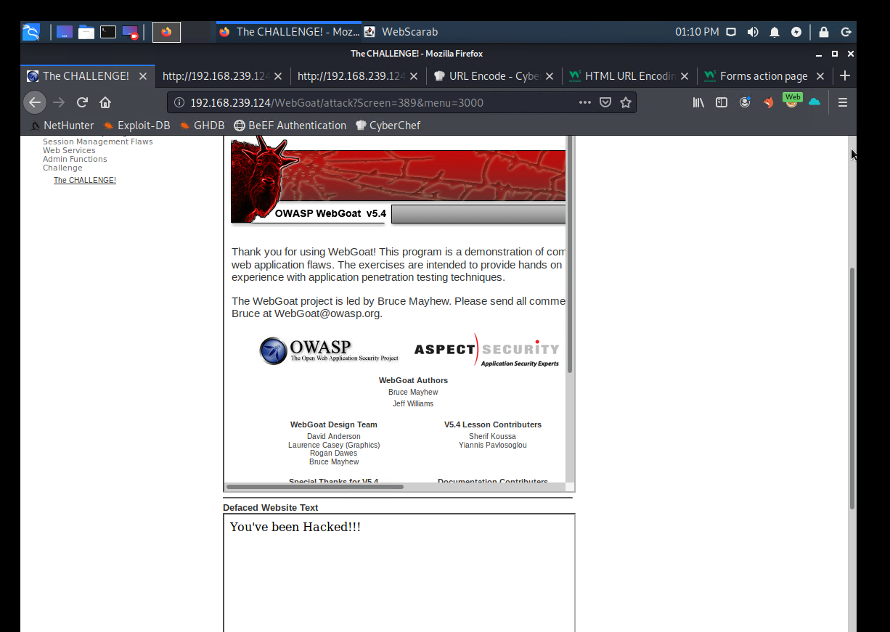

## Unit 15 Submission File: Web Vulnerabilities and Hardening

### Part 1: Q&A

#### The URL Cruise Missile

The URL is the gateway to the web, providing the user with unrestricted access to all available online resources. In the wrong hands can be used as a weapon to launch attacks.

Use the graphic below to answer the following questions:

| Protocol         | Host Name                 | Path                   | Parameters               |
| ---------------- | :-----------------------: | ---------------------- | ------------------------ |
| **http://**      | **`www.buyitnow.tv`**     | **/add.asp**           | **?item=price#1999**     |

1. Which part of the URL can be manipulated by an attacker to exploit a vulnerable back-end database system? 

Answer: The ?item=price#1999 could be exploited by changing the price of the item.

2. Which part of the URL can be manipulated by an attacker to cause a vulnerable web server to dump the `/etc/passwd` file? Also, name the attack used to exploit this vulnerability.

TODO: Answer:
   
3. Name three threat agents that can pose a risk to your organization.

TODO: Answer:

4. What kinds of sources can act as an attack vector for injection attacks?

TODO: Answer: HTML, SQL Databases,

5. Injection attacks exploit which part of the CIA triad?

Answer: Injection attacks undermine the Confidentiality of the Triad.  Depending on the attack, it can also jeopardize the Integrity, by writing false data to the database.  In severe scanning instances, it could also affect the Availability of the database.
  In short, Command Injection atacks can affect all areas of the CIA triad.

6. Which two mitigation methods can be used to thwart injection attacks?

Answer: You should always do Input Sanitization, meaning strip illegal or bad characters from the user's input.
____

#### Web Server Infrastructure

Web application infrastructure includes  sub-components and external applications that provide  efficiency, scalability, reliability, robustness, and most critically, security.

- The same advancements made in web applications that provide users these conveniences are the same components that criminal hackers use to exploit them. Prudent security administrators need to be aware of how to harden such systems.
 Input Validation also helps to verify the user is not trying to process illegal character and exploit the database. Secure Software Deployment Cycles (SDLC) keeps your code secure.

Use the graphic below to answer the following questions:

| Stage 1        | Stage 2             | Stage 3                 | Stage 4              | Stage 5          |
| :------------: | :-----------------: | :---------------------: | :------------------: | :--------------: |
| **Client**     | **Firewall**        | **Web Server**          | **Web Application**  | **Database**     |
   
   
1. What stage is the most inner part of the web architecture where data such as, customer names, addresses, account numbers, and credit card info, is stored?

Answer: Stage 5: Database

2. Which stage includes online forms, word processors, shopping carts, video and photo editing, spreadsheets, file scanning, file conversion, and email programs such as Gmail, Yahoo and AOL.

Answer: Stage 4: Web Applications

3. What stage is the component that stores files (e.g. HTML documents, images, CSS stylesheets, and JavaScript files) that's connected to the Internet and provides support for physical data interactions between other devices connected to the web?

Answer: Stage 3: Web Server

4. What stage is where the end user interacts with the World Wide Web through the use of a web browser?

Answer: Stage 1: Client

5. Which stage is designed to prevent unauthorized access to and from protected web server resources?

Answer: Stage 2: Firewall

----

#### Server Side Attacks

In today’s globally connected cyber community, network and OS level attacks are well defended through the proper deployment of technical security controls such as, firewalls, IDS, Data Loss Prevention, EndPoint and security. However, web servers are accessible from anywhere on the web, making them vulnerable to attack.

1. What is the process called that cleans and scrubs user input in order to prevent it from exploiting security holes by proactively modifying user input.

Answer: Input Sanitization

2. Name the process that tests user and application-supplied input. The process is designed to prevent malformed data from entering a data information system by verifying user input meets a specific set of criteria (i.e. a string that does not contain standalone single quotation marks).

Answer: Input Validation

3. **Secure SDLC** is the process of ensuring security is built into web applications throughout the entire software development life cycle. Name three reasons why organization might fail at producing secure web applications.

Answer: Companies may fail SDLC because of the high cost, lack of standardization, quality management, or even support from management.

4. How might an attacker exploit the `robots.txt` file on a web server?

Answer: The robots.txt file supplies a list to crawlers (search engine's) of what directories the search engine should NOT index. These directories might contain PII, and provide the hacker with an easy directory structure.

5. What steps can an organization take to obscure or obfuscate their contact information on domain registry web sites?

Answer:  IANA allows domains to hide their personal information.  If you wish to obfuscate your information, please consult your Registrar!

   
6. True or False: As a network defender, `Client-Side` validation is preferred over `Server-Side` validation because it's easier to defend against attacks.

   - Explain why you chose the answer that you did.

Answer:  I would most certainly say FALSE!  Client-Side validation can be faked/forced.  Where server-side validation is much harder to spoof.

____

#### Web Application Firewalls

WAFs are designed to defend against different types of HTTP attacks and various query types such as SQLi and XSS.

WAFs are typically present on web sites that use strict transport security mechanisms such as online banking or e-commerce websites.

1. Which layer of the OSI model do WAFs operate at?

Answer: Layer 7 - because HTTP traffic is Layer 7

2. A WAF helps protect web applications by filtering and monitoring what?

TODO: Answer: HTTP Traffic?

3. True or False: A WAF based on the negative security model (Blacklisting) protects against known attacks, and a WAF based on the positive security model (Whitelisting) allows pre-approved traffic to pass.
 
Answer: TRUE

____

#### Authentication and Access Controls

Security enhancements designed to require users to present two or more pieces of evidence or credentials when logging into an account is called multi-factor authentication.

- Legislation and regulations such as The Payment Card Industry (PCI) Data Security Standard requires the use of MFAs for all network access to a Card Data Environment (CDE).

- Security administrators should have a comprehensive understanding of the basic underlying principles of how MFA works.

1. Define all four factors of multifactor authentication and give examples of each:

   - Factor 1:
 Standard Login (Password or PIN)
   
   - Factor 2:
 Physical Keys (SmartCard)  
   
   - Factor 3:
 BioMetrics (Fingerprint, Face Scan, Retina Scan)
   
   - Factor 4:
 Location (GPS Based)
   
2. True or False: A password and pin is an example of 2-factor authentication.

Answer: False, they both fall under Standard Login
   
3. True or False: A password and `google authenticator app` is an example of 2-factor authentication.

Answer: True
   
4. What is a constrained user interface? 

Answer: Allows users to only edit/change/view things they have permission to.

----
____

### Part 2: The Challenge 

In this activity, you will assume the role of a pen tester hired by a bank to test the security of the bank’s authentication scheme, sensitive financial data, and website interface.

#### Challenge #1

#### Challenge #2
   - First you must use TamperData to change the form fields

   - Which provides a list of everyone's info.

#### Challenge #3

- There should be two webpages at the bottom of the window. The one on top is the original, and the one on the bottom will be the defaced webpage.  This is a screenshot before defacing.

   

- Start Foxy Proxy (WebScarab) to send all GET/POST requests from Firefox to the WebScarab proxy intercept.

   

- Click **TCP** and then the **View Network** button and send the request to WebScarab.
- The WebScarab window will open.
   

- Next, perform a test and see if this shell is vulnerable to command injection. 

   
   
   - Next, we'll locate the `webgoat_challenge_guest.jsp` file. 

   
   
   - The absolute path is: `./owaspbwa/owaspbwa-svn/var/lib/tomcat6/webapps/WebGoat/webgoat_challenge_guest.jsp`.
   
   
   
   - Remember, our present working directory is `/var/lib/tomcat6`. Therefore, the relative path is `webapps/WebGoat/webgoat_challenge_guest.jsp`.
   
Completed Challenge:
   - After the defacing

---
© 2020 Trilogy Education Services, a 2U, Inc. brand. All Rights Reserved.  
