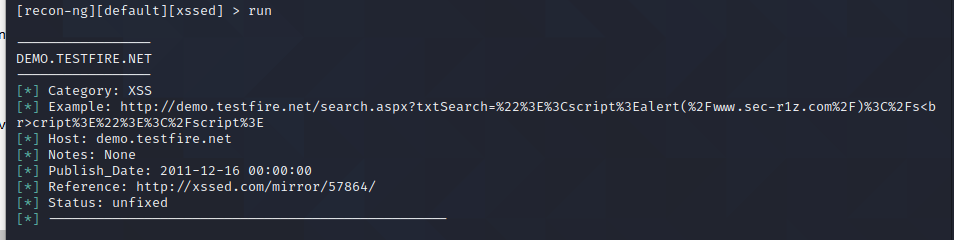

## Week 16 Homework Submission File: Penetration Testing 1

- #### Step 1: Google Dorking

Using Google, can you identify who the Chief Executive Officer of Altoro Mutual is:

Answer: insite:altoromutual.com Chief Executive Officer - Karl Fitsgerald

How can this information be helpful to an attacker:

Answer: They can use a whaling technique to phish for the CEO.  Or pretend to be the CEO and send out false emails.

- #### Step 2: DNS and Domain Discovery

Enter the IP address for `demo.testfire.net` into Domain Dossier and answer the following questions based on the results:

  1. Where is the company located:

 Answer: San Antonio, TX 78229

  2. What is the NetRange IP address:

 Answer: 65.61.137.64 - 65.61.137.127 OR 65.61.137.64/26

  3. What is the company they use to store their infrastructure
:
 Answer:www.rackspace.com

  4. What is the IP address of the DNS server:

 Answer: asia3.akam.net

- #### Step 3: Shodan

What open ports and running services did Shodan find:

Answer: Ports 80, 443, 8080.  These are Apache servers.

-#### Step 4: Recon-ng

Is Altoro Mutual vulnerable to XSS:

 Answer: Yes

-### Step 5: Zenmap

Your client has asked that you help identify any vulnerabilities with their file-sharing server. Using the Metasploitable machine to act as your client's server, complete the following:

- Command for Zenmap to run a service scan against the Metasploitable machine:

 Answer: nmap -sV  192.168.0.10
 

- Bonus command to output results into a new text file named `zenmapscan.txt`:

 Answer: nmap -sV 192.168.0.10 -oN zenmapscan.txt

- Zenmap vulnerability script command: 

 Answer: nmap -sC -sS 192.168.0.10

- Once you have identified this vulnerability, answer the following questions for your client:
  1. What is the vulnerability:

 Answer: vsftpd - https://cve.mitre.org/cgi-bin/cvename.cgi?name=CVE-2011-2523

  2. Why is it dangerous:

 Answer: It allows a hacker to open a back door into the remote system, and after that remote shell.

  3. What mitigation strategies can you recommendations for the client to protect their server:

 Answer: This particular exploit is almost a decade old, update already!

---
© 2020 Trilogy Education Services, a 2U, Inc. brand. All Rights Reserved.  

