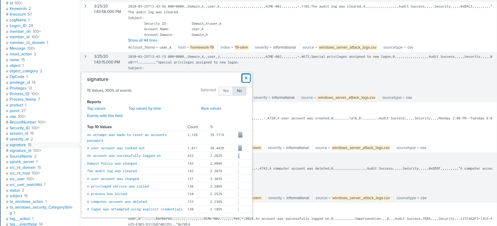
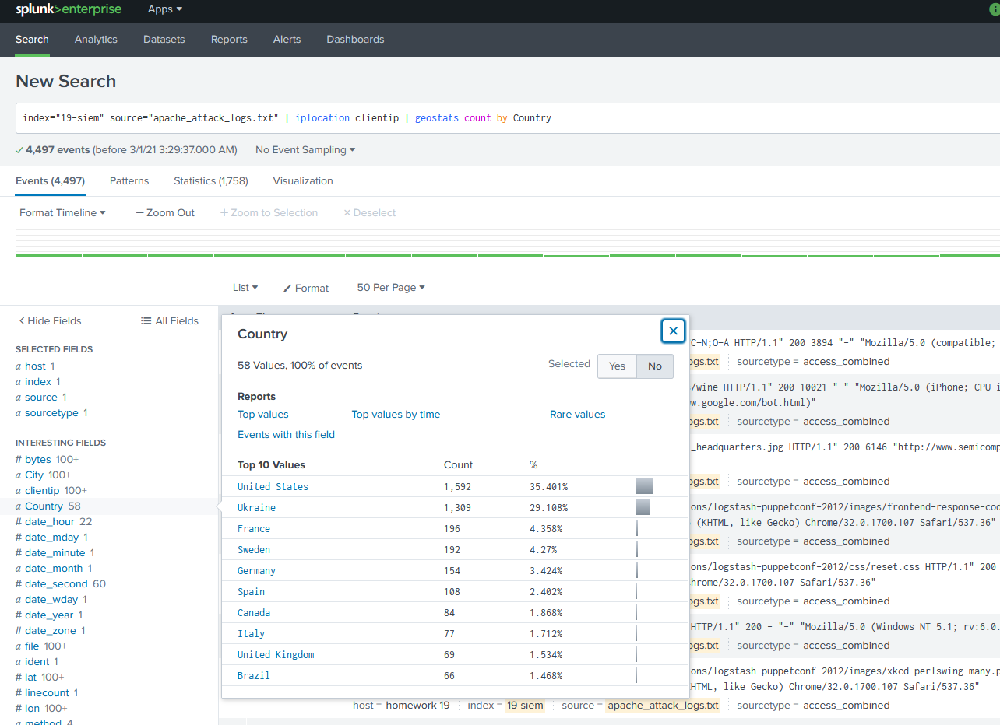
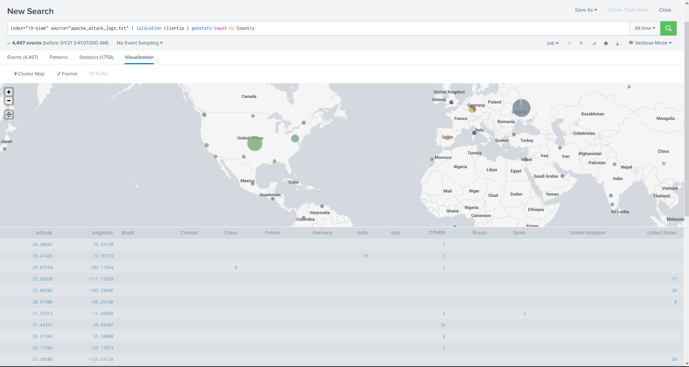

Part 1: Windows Server Attack
Question 1:

	Based on the top two signatures in the attack logs, the attacker was trying to reset account passwords.  After this attempt failed an account would be locked out. If password are an issue, users could always login with a key card.  Eliminating the need for passwords.  However a 2-factor authention would be preferred. Ie a passsword login, and a key card.  Both being required to login to any company computer.
 

Question 2:

	One way to help mitigate against Denial of Service attacks via account lockout could be to add a random length, randomly occuring pause when checking checking a users' password.  Something like a 2-3 second pause will not effect your legitimate user, but can really slow down brute force attacks.  Another technique would be to bad IP addresses of repeated failed login attempts.  This keeps the account open for the legitimate user, but blocks access from the offending IP.

Part 2: Apache Webserver Attack:

Question 1:
	I would set a firewall rule to block all incoming http traffic from the Ukraine.  Even better, if all employess are based in America, only allow IP addresses from the United States.  For even more added security, you could allow access from within the company VPN.
 
 

Question 2:
	If a Virtual Private Network is properly implemented, JobeCorp could use countless IP's with no success at all.  The only rule needed here would be to institute a deny by default rule and then whitelist the VPN IP.